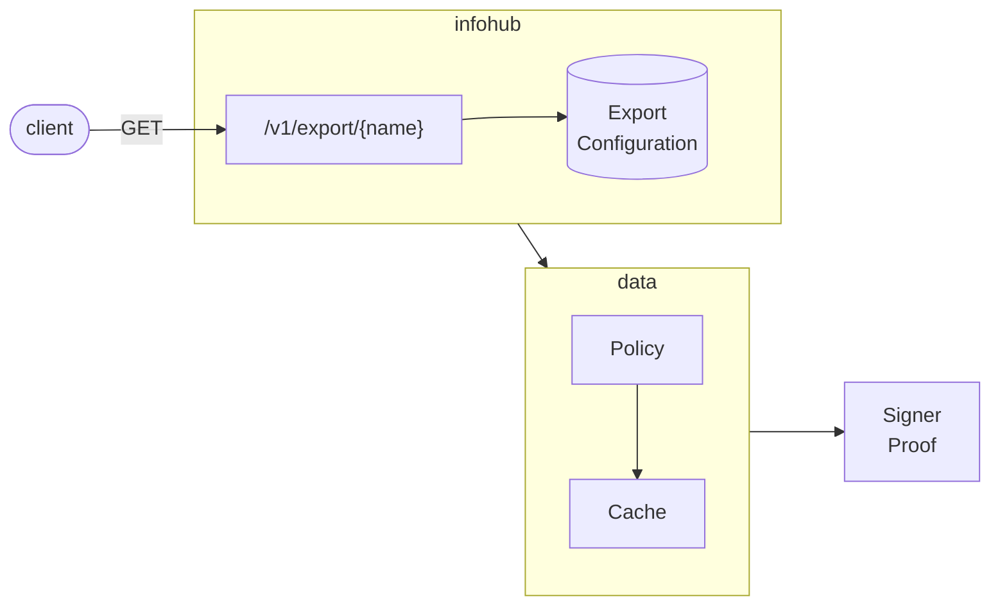
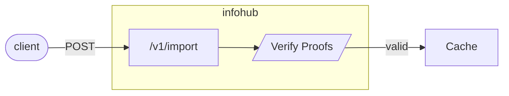

[](https://github.com/eclipse-xfsc/trusted-info-hub/-/commits/main)
[](https://github.com/eclipse-xfsc/trusted-info-hub/-/commits/main)

# Information Hub

Information Hub service is responsible for exporting and importing policy data 
wrapped in Verifiable Credentials and Verifiable Presentations.

It is developed using the [Goa v3](https://goa.design/) framework.

While the service is up and running, you can see a live Swagger API
description at `servicehost:serviceport/swagger-ui`. In the local docker-compose
environment, the Swagger URL is available at http://localhost:8084/swagger-ui/

### Export

An export *must* be defined by Export Configuration stored in a MongoDB collection named `exports`.
Clients trigger an export by making an HTTP GET request using the name of the export as path
parameter. No other parameters are necessary to perform an export except its name. 

Export returns JSON data wrapped as Verifiable Credentials and Verifiable Presentations. 
The data itself is the result of one or more policy executions and is *always* taken from
the Cache service. If data for a given export is not found in the Cache, then policy evaluation
is triggered so that the data can be placed in Cache for future exports.

After the data is retrieved from Cache, it is wrapped in [VC/VP](https://www.w3.org/TR/vc-data-model) 
and is given to the Signer service for adding a [VP proof](https://www.w3.org/TR/vc-data-model/#proofs-signatures).



### Import

An import can put arbitrary external JSON data into the TSA Cache.
The data must be wrapped as Verifiable Presentation, similar to exports.
If VP proofs are verified successfully, the data is inserted into the Cache
and the cache key by which the data can later be retrieved is returned 
in the response to the import request.


### Build

#### Local binary
To make the service binary locally, you can run the following command from the root
directory (you must have [Go](https://go.dev/) installed):
```shell
go build -o infohub ./cmd/infohub/...
```

#### Docker image

You can see the Dockerfile of the service under the [deployment](./deployment) directory.
There is one Dockerfile for use during local development with docker-compose and one for
building an optimized production image: [deployment/docker/Dockerfile](./deployment/docker/Dockerfile).

### Configuration

The Infohub service is configured using the [Configuration File](./internal/config/config.go).
All configurations are expected as Environment variables specified in the
configuration file. For managing the configuration data from ENV variables,
[envconfig library](https://github.com/kelseyhightower/envconfig) is used.

### Dependencies and Vendor

The project uses Go modules for managing dependencies and we commit the vendor directory.
When you add/change dependencies, be sure to clean and update the vendor directory before
submitting your Merge Request for review.

```shell
go mod tidy
go mod vendor
```

### Tests and Linters

To execute the units tests for the service go to the root project directory and run:

```shell
go test -race ./...
```

To run the linters go to the root project directory and run:
```shell
golangci-lint run
```

## GDPR

[GDPR](GDPR.md)

## Dependencies

[Dependencies](go.mod)

## Deployment

[Helm deployment documentation](deployment/helm/README.md)

## License

[Apache 2.0 license](LICENSE)
